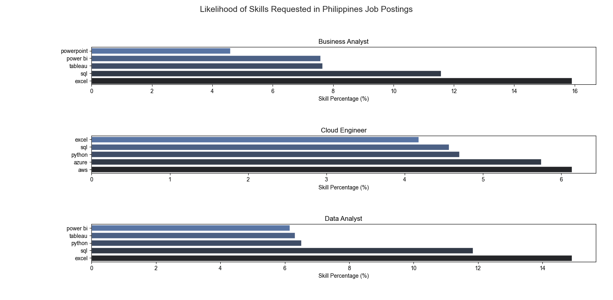
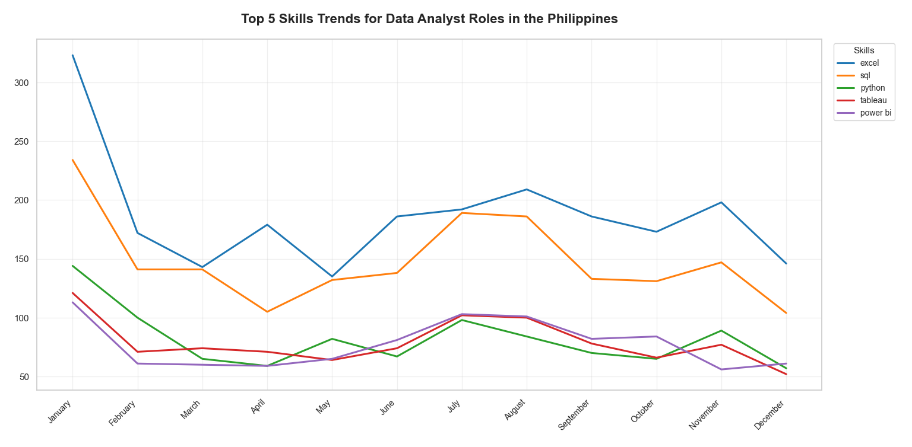
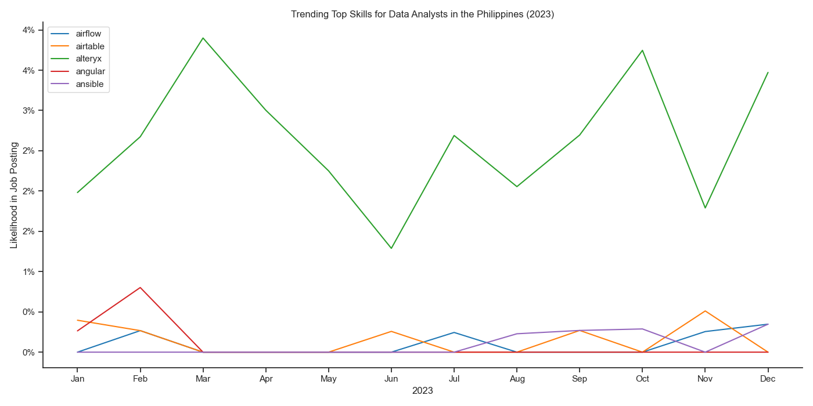

# Python-Based Data Analysis 🖥️

## Analyzing Data Roles in the Philippines  

This project is inspired by **Luke Barousse's Data Analyst Portfolio Project** on YouTube.  
The difference is that I adapted it to focus specifically on the **Philippines**, where I am from.  

### Dataset  
The dataset used in this project is credited to **Luke Barousse** and is available on his official site. 

# Goals 🏁

1. 🔍 Perform **EDA** (Exploratory Data Analysis) on data roles worldwide —  
   providing insights such as 🌍 countries with the most job postings, 🏢 top hiring companies,  
   🏡 work-from-home possibilities, and more.
2. 💰 Analyze **Salaries** to compare pay across roles, regions, and companies.
3. 🛠️ Explore **Skills** — identifying which skills 💵 pay better and 📈 are in demand.
4. 📊 Provide an **overview of skill trends**, showing how demand evolves over time.
5. 🏆 Discover the **most optimal skill** to learn for maximizing opportunities.

# EDA 🔍  

## Overview  
This section performs **Exploratory Data Analysis (EDA)** to summarize and visualize the data.  
The plots are based on the sorting and counting of different columns in the dataset.  

### Code Example
```python
# Top 5 Data Roles, Countries, and Companies
df_da_roles = df["job_title_short"].value_counts().head(5).to_frame("count")
df_da_countries = df["job_country"].value_counts().head(5).to_frame("count")
df_da_companies = df["company_name"].value_counts().head(5).to_frame("count")

# Mapping columns for visualization
dict_column = {
    'job_work_from_home': 'Work from Home Offered',
    'job_no_degree_mention': 'Degree Requirement',
    'job_health_insurance': 'Health Insurance Offered'
}
```
## Result Plots: Bar Chart 📊
[](charts/Top%205%20data%20internatioanl.png)

## Result Plots: Pie Chart 🥧
[](charts/opportunities%20for%20the%20top%205%20data%20international.png)

## Key Insights 💡

1. 👨‍💻 **Data Roles:** Data Analysts hold the most positions, followed by Data Engineers and Data Scientists.  
2. 🌍 **Job Locations:** Most jobs are concentrated in English-speaking countries like the US, India, and the UK.  
3. 🏢 **Top Company:** Empreego has posted the most jobs by a wide margin.  
4. 🏠 **Work Setup:** Most jobs are performed at the office rather than remotely.  
5. 🎓 **Degree Requirement:** Only 30% of companies worldwide require a degree.  
6. 🩺 **Benefits:** Only 11% of companies offer health insurance.
# EDA 🔍  

## Overview  
This section performs **Exploratory Data Analysis (EDA)** to summarize and visualize the data.  
The plots are based on the sorting and counting of different columns in the dataset. 
The code bellow demonstrates the method of sorting the data relevant to this section's
goal.

### Code Example
```python
# Top 5 Data Roles, Countries, and Companies
df_da_roles = df["job_title_short"].value_counts().head(5).to_frame("count")
df_da_countries = df["job_country"].value_counts().head(5).to_frame("count")
df_da_companies = df["company_name"].value_counts().head(5).to_frame("count")

# Mapping columns for visualization
dict_column = {
    'job_work_from_home': 'Work from Home Offered',
    'job_no_degree_mention': 'Degree Requirement',
    'job_health_insurance': 'Health Insurance Offered'
}
```
## Result Plots: Bar Chart 📊
[](charts/Top%205%20data%20internatioanl.png)

## Result Plots: Pie Chart 🥧
[](charts/opportunities%20for%20the%20top%205%20data%20international.png)

## Key Insights 💡

1. 👨‍💻 **Data Roles:** Data Analysts hold the most positions, followed by Data Engineers and Data Scientists.  
2. 🌍 **Job Locations:** Most jobs are concentrated in English-speaking countries like the US, India, and the UK.  
3. 🏢 **Top Company:** Empreego has posted the most jobs by a wide margin.  
4. 🏠 **Work Setup:** Most jobs are performed at the office rather than remotely.  
5. 🎓 **Degree Requirement:** Only 30% of companies worldwide require a degree.  
6. 🩺 **Benefits:** Only 11% of companies offer health insurance.

# Salary Analysis 💰

## Overview  
This section performs **Salary Analysis** to summarize and visualize the salary data in the Philippines.  
The plots are based on the sorting and counting of different columns in the dataset.  
The code below demonstrates how the data is filtered and processed for this analysis.

### Code Example
```python
# Filter only Data Analyst jobs in PH + remove NaN salaries
df_ph_da = df[(df["job_title_short"] == "Data Analyst") & (df["job_country"] == "Philippines")].copy()
df_ph = df_ph_da.dropna(subset=["salary_year_avg"]).copy()

# Convert salary to PHP (assuming 1 USD = 56 PHP)
df_ph["salary_year_avg_php"] = df_ph["salary_year_avg"] * 56

# Explode skills for analysis
df_ph_skills = df_ph.explode("job_skills")
```
## Result Plots: Bar Chart 📊
[](charts/Salary%20Distributions.png)

## Result Plots: Pie Chart 🥧
[](charts/Highest%20Paid%20and%20Most%20Demand%20Skills.png)

## Key Insights 💡

1. 👨‍💻 **Data Analyst Salaries:** 50% of Data Analysts in the Philippines earn between **₱3M–₱6M per year**.  
2. 📉 **Limited Data:** Machine Learning and Cloud Engineer roles show only vertical lines in the box charts, indicating very few data points are available.  
3. 🔹 **Outliers:** Only Data Engineers and Business Analysts have outliers, suggesting a relatively uniform salary trend across most roles.  
4. 💵 **Highest-Paid Skills:** BigQuery, C, Flow, Sheets, and Zoom are among the highest-paid skills in the Philippine setting, all earning over **₱6M per year**.  
5. 📊 **Most In-Demand Skills:** SQL is the most in-demand skill among data roles in the Philippines, followed by Excel and Python.

# Skills Analysis 🛠️

## Overview  
This section performs **Skills Analysis** to summarize and visualize the top skills in demand in the Philippines.  
The plots are based on the sorting and counting of different columns in the dataset.  
The code below demonstrates how the data is filtered and processed for this analysis.

### Code Example
```python
def plot_figure_1():
    # Grouping the Data
    df_skills_count = df_ph.groupby(["job_skills", "job_title_short"]).size()
    df_skills_count = df_skills_count.reset_index(name="Skill_Count")
    df_skills_count = df_skills_count.sort_values(by="Skill_Count", ascending=False)

    # Top 3 Job Titles
    df_job_titles = df_skills_count["job_title_short"].unique().tolist()
    df_job_titles = sorted(df_job_titles[:3])

    # Plotting Skills Count
    fig, ax = plt.subplots(len(df_job_titles), 1)

    sns.set_theme(style="ticks")

    for i, job_title in enumerate(df_job_titles):
        df_plot = df_skills_count[df_skills_count['job_title_short'] == job_title].head(5)[::-1]
        sns.barplot(
            data=df_plot,
            x='Skill_Count',
            y='job_skills',
            ax=ax[i],
            palette='dark:b_r'
        )
        ax[i].set_title(job_title)
        ax[i].set_ylabel('')
        ax[i].set_xlabel('Skill Count')
        ax[i].invert_yaxis()
        ax[i].set_xlim(0, 3000)  # uniform scale

    fig.suptitle('Top Skills in Job Postings (Philippines)', fontsize=15)
    fig.tight_layout()
    plt.show()
```
## Result Plots: Bar Chart 📊
[](charts/top%20skills.png)

## Result Plots: Pie Chart 🥧
[](charts/percentages.png)

## Key Insights 💡

1. 👩‍💼 **Roles Requiring More Skills:** Business Analysts, Data Analysts, and Data Engineers typically look for candidates with more skills.  
2. 🏆 **Most Popular Skills:** Excel is most popular among Business and Data Analysts, followed by SQL; Data Engineers favor SQL and Python.  
3. 📊 **Roles with 5+ Skills Required:** Business Analysts, Cloud Engineers, and Data Analysts often require five or more skills.  
4. 💻 **Skill Preferences by Role:** Excel remains popular for Business and Data Analysts, while Cloud Engineers favor AWS.

# Skill Trends 📊

## Overview  
This section performs **Skills Trend Analysis** to summarize and visualize the top skills in demand for Data Analysts throughout the year in the Philippines.  
The plots are based on the sorting and counting of different columns in the dataset.  
The code below demonstrates how the data is filtered and processed for this analysis.

### Code Example
```python
def plot_figure_1():
    # Generate Pivot Table
    df_pivot = df_ph_da_skills_exploded.pivot_table(
        index="job_posted_month_no", 
        columns="job_skills", 
        aggfunc="size", 
        fill_value=0
    )

    # Reorder columns by total counts
    df_pivot.loc["Total"] = df_pivot.sum()
    df_pivot = df_pivot[df_pivot.loc['Total'].sort_values(ascending=False).index]
    df_pivot = df_pivot.drop("Total")

    # Convert month numbers → full month names
    df_pivot.index = df_pivot.index.map(lambda x: calendar.month_name[x])
    df_pivot = df_pivot.astype(int)

    # Plot
    sns.set_theme(style="whitegrid", rc={"figure.figsize": (14, 7)})

    ax = sns.lineplot(
        data=df_pivot.iloc[:, :5],  # top 5 skills
        dashes=False,
        palette="tab10",
        linewidth=2.2
    )

    # Titles only (no axis labels)
    ax.set_title(
        "Top 5 Skills Trends for Data Analyst Roles in the Philippines",
        fontsize=16,
        weight="bold",
        pad=20
    )
    ax.set_ylabel("")  # remove y-axis label
    ax.set_xlabel("")  # remove x-axis label

    # Use month names as x-ticks
    ax.set_xticks(range(len(df_pivot.index)))
    ax.set_xticklabels(df_pivot.index, rotation=45, ha="right", fontsize=10)
    ax.yaxis.set_major_formatter(mtick.StrMethodFormatter('{x:,.0f}'))

    # Legend outside for clarity
    ax.legend(
        title="Skills",
        fontsize=10,
        title_fontsize=11,
        loc="upper left",
        bbox_to_anchor=(1.01, 1)
    )

    # Add grid styling
    ax.grid(alpha=0.3)

    plt.tight_layout()
    plt.show()
```
## Result Plots: Bar Chart 📊
[](charts/skills_trend.png)

## Result Plots: Pie Chart 🥧
[](charts/Likelihood.png)

## Key Insights 💡
1. 📈 **Peak Months:** Most skills see the highest number of postings in **January**, with Excel being the most wanted skill, followed by SQL and Python.  
2. 📉 **Low Months:** Postings tend to dip in **March and May**, before recovering by June.  
3. ✨ **Alteryx Spike:** Alteryx postings peak particularly in **March and October**.  
4. 🏆 **Top Skill Percentage:** Alteryx has the highest overall percentages among the analyzed skills.


   
